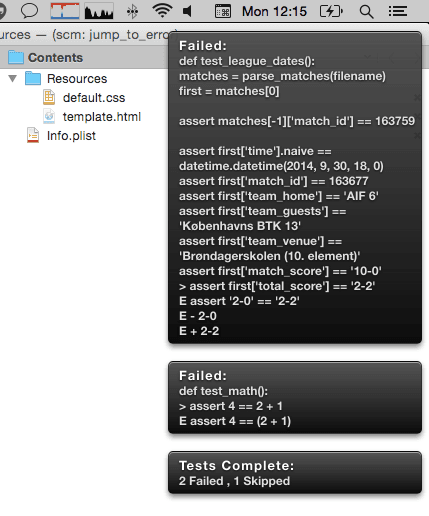

pytest-growl
------------
 :Author: Anthony Long
 :Date: 20/10/2014
 :Version: 0.1

This plugin sends growl notifications when your test session begins and ends, along with result counts in a short format.

The theme displayed in the image is included if you wish to use it.

Installation
____________

Install with pip::

  pip install pytest-growl

Usage
_____

Invoke with the ``--growl`` option. Unfortunately py.test will not accept the option without a value::

  py.test --growl=GROWL

Configuration
_____________

Example ``pytest.ini``::

  [pytest]
  quiet_growl=True
  growl_url=txmt://open/?url=file://{path}&line={lineno}&column=1

If ``quiet_growl`` is true no Test Start / End notifications will be shown.

The value of ``growl_url`` is an URL that will be called when an individual error notification is clicked. In the example TextMate is opened with the caret at the error line.
